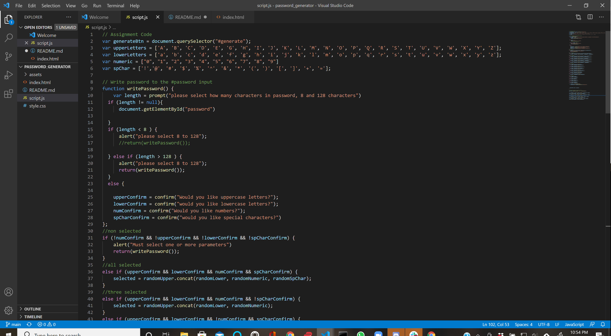
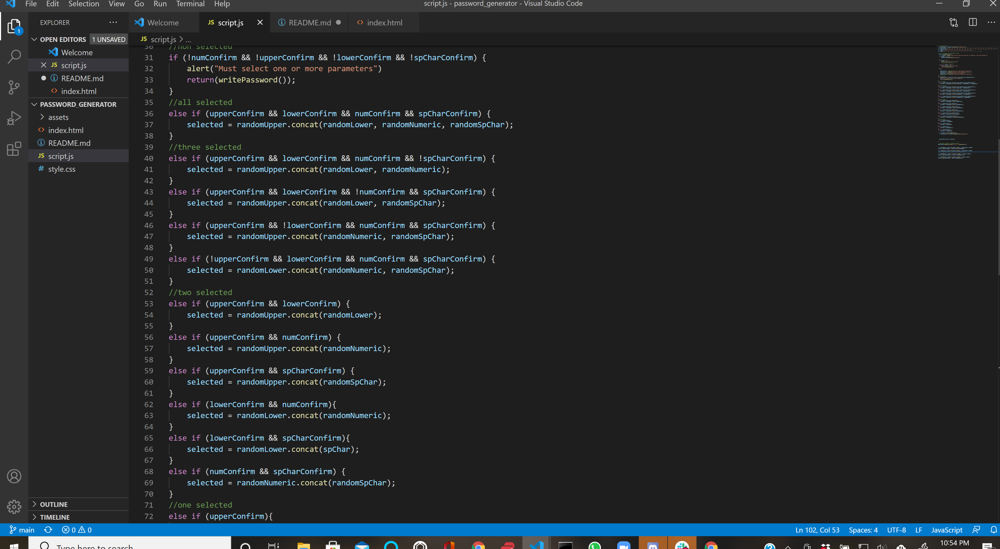
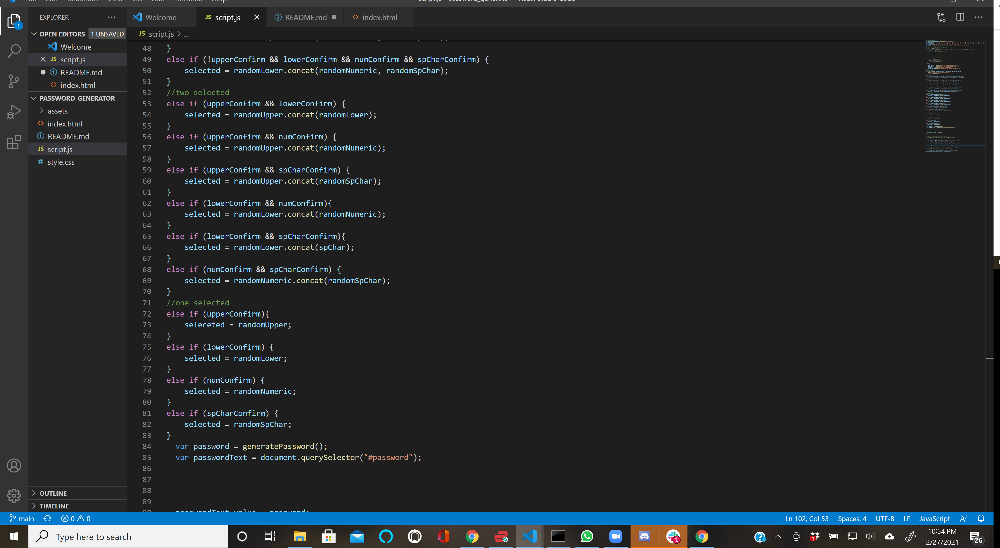
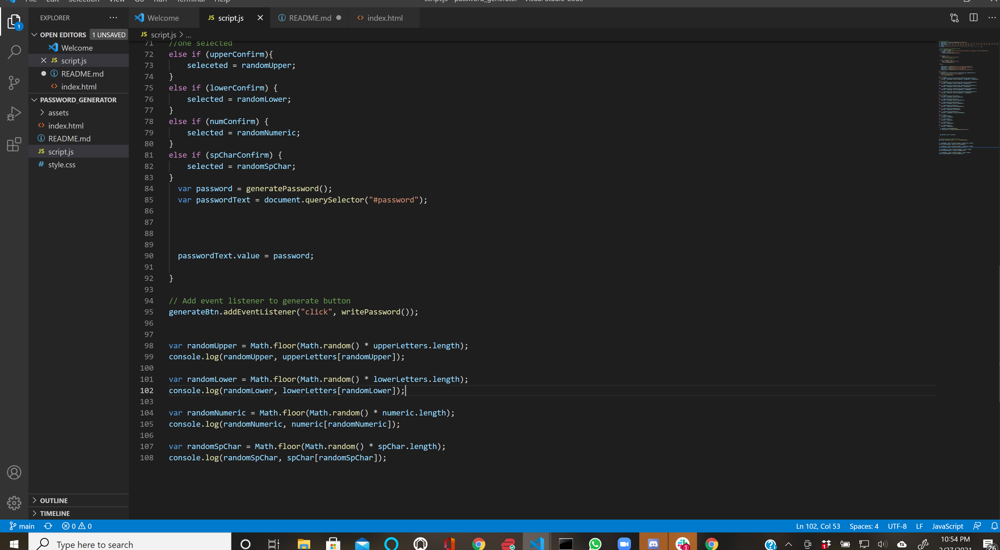

# password_generator
As requested I had made a password generator. It includes upper and lowercase letters, numbers and symbols.
## Over View
* W3schools was very helpful with the prompts and alerts. It has been a very useful tool. [W3schools](https://www.w3schools.com/jsref/met_win_prompt.asp), 
[W3schools](https://www.w3schools.com/jsref/met_win_alert.asp) I realized to use and alert when prompt didnt work and searching for them on W3schools.
* [stackoverflow](https://stackoverflow.com/questions/1497481/javascript-password-generator) was helpful as well in clues on Math aspects and reminders on forming the code
* I unerstand I need a for loop but am unsure on how to add it as well as following the seleceted parameters !!will update when implemented
### Screen Shots

